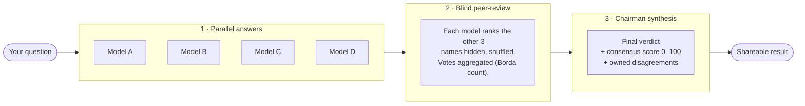

<div align="center">

# ⟁ Quorum

### Open-source multi-LLM council: 4 AIs answer, peer-review each other blindly, then deliver one verdict with a consensus score.

**Free. No signup. Bring your own key.**

<!-- DEMO GIF -->


<sub>🇫🇷 <a href="docs/demo-fr.gif">Version française</a></sub>

<br/>

[](https://github.com/adammltr/Quorum/stargazers)
[](LICENSE)
[](https://github.com/adammltr/Quorum/actions/workflows/gitleaks.yml)
[](#-byok--privacy)
[](https://www.typescriptlang.org/)

[**Live demo**](https://quorum-nine-ebon.vercel.app) · [**Self-host**](#-quick-start) · [**How it works**](#-how-it-works) · [**Roadmap**](#-roadmap) · [**Contributing**](CONTRIBUTING.md)

</div>

---

## Why Quorum?

You ask one model. It answers with total confidence. You have no idea if it's right.

- **A single model hallucinates** — and never tells you when. One voice, one blind spot, zero way to audit it.
- **You don't know who to trust** — GPT, Claude, Llama, Gemini all sound equally sure. Confidence isn't correctness.
- **Disagreement between models is signal** — when four independent reasoners *converge*, that's a strong prior. When they *split*, you've just found exactly where the question is genuinely hard.

Quorum turns that into a protocol. Four models answer in parallel, grade each other's work **without knowing who wrote what**, and a "Chairman" model synthesizes a single verdict with an honest **consensus score (0–100)** and a list of where they disagreed. It's not a chatbot in a theme — it's a deliberative process made visible.

> Intellectual inspiration: [karpathy/llm-council](https://github.com/karpathy/llm-council).

---

## ⚡ Quick Start

### Use it online
No install, no account. Open **[quorum-nine-ebon.vercel.app](https://quorum-nine-ebon.vercel.app)**, type a question, watch four models deliberate. First verdict in under a minute.

### Self-host (< 5 commands)

**Requirements:** Node.js ≥ 20, [pnpm](https://pnpm.io/) ≥ 9, a free [OpenRouter](https://openrouter.ai/) key, a free [Supabase](https://supabase.com/) project.

```bash
git clone https://github.com/adammltr/Quorum.git && cd Quorum
cp .env.example .env.local      # fill in the values below
pnpm install
supabase start                  # local Postgres + Edge Functions (Docker)
pnpm dev                        # http://localhost:5173
```

**Minimum env vars** (full reference and comments in [`.env.example`](.env.example)):

| Variable | Where | What |
|---|---|---|
| `OPENROUTER_API_KEY` | server | OpenRouter key — runs the `:free` models. **Server-only**, never exposed to the browser. |
| `VITE_SUPABASE_URL` | public | Your Supabase project URL. |
| `VITE_SUPABASE_ANON_KEY` | public | Supabase anon key (public by design, protected by RLS). |
| `SUPABASE_SERVICE_ROLE_KEY` | server | Admin key — Edge Functions only. **Never** prefix with `VITE_`. |
| `BYOK_ENCRYPTION_KEY` | server | AES-256-GCM master key for encrypting users' personal keys. `openssl rand -base64 32`. |

> The `OPENROUTER_API_KEY` lives **only** inside Supabase Edge Functions. It never reaches the client. Anything prefixed `VITE_` is public — keep secrets unprefixed.

---

## 🧭 How it works



1. **Parallel answers** — your question hits 4 models simultaneously via OpenRouter. Tokens stream into 4 live cards. If one stalls or errors, the flow degrades gracefully and continues with the rest.
2. **Blind peer-review** — once all are done, each model receives the *other three* answers, anonymized and shuffled (“Model A/B/C”), and produces a ranking. Votes are aggregated with a Borda count (1st = 3 pts, 2nd = 2, 3rd = 1).
3. **Chairman synthesis** — a 5th call receives the question, all four answers, and the aggregated scores, then writes a final verdict, a consensus score, and the points where models genuinely diverged.

---

## ✨ Features

- **4-model parallel council** with real-time token streaming.
- **Blind cross-evaluation** — models can't favor "their own kind"; identities are stripped.
- **Consensus score + owned disagreements** — convergence and divergence both surfaced honestly.
- **Zero-signup first run** — value before account. A rotating inspiring question is pre-filled.
- **BYOK** — bring your own OpenRouter key to unlock premium models (GPT, Claude, Gemini, Grok…).
- **Shareable result pages** — public SSR URL + dynamic OG image, free forever even on the free tier.
- **Question of the Day** — one editorial question for everyone, Wordle-style share grid.
- **Dark-first, accessible design** — WCAG 2.2 AA target, `prefers-reduced-motion` respected, 60 fps.

---

## 🛠 Tech stack

| Layer | Tech |
|---|---|
| Build | Vite + `@tailwindcss/vite` |
| UI | React 19 + TypeScript (strict) |
| Styling | Tailwind v4 + shadcn/ui (`new-york`), OKLCH tokens |
| Animation | Motion (ex-Framer Motion) |
| Backend | Supabase — Postgres + Auth + Edge Functions (Deno) |
| LLM gateway | OpenRouter (`:free` models by default, BYOK for premium) |
| Share/OG/SSR | Vercel serverless functions (`api/`) + `@vercel/og` |

Design system: [`docs/DESIGN.md`](docs/DESIGN.md) · Product spec: [`docs/SPEC.md`](docs/SPEC.md).

---

## 🔒 BYOK & privacy

- The default demo runs on **free** OpenRouter models, behind a **server-side** key. You never need an account to try it.
- **Bring Your Own Key:** your personal OpenRouter key is stored **encrypted** (AES-256-GCM) server-side — **never in localStorage, never in the browser**.
- IP-based rate limiting hashes your IP with a salt; **the raw IP is never stored**.
- Sharing is free and unlimited, even on the free tier.

This is open-core: the full deliberation engine is AGPL-3.0 and self-hostable. Paid tiers (hosted convenience, unlimited history) fund the project; they don't gate the core protocol.

---

## 🗺 Roadmap

- [x] Parallel streaming · blind peer-review · Chairman verdict
- [x] Shareable result pages + dynamic OG images
- [x] Custom councils (pick your own 4 models)
- [x] PWA manifest + theme-color
- [x] Sidebar navigation + history
- [x] Collections + personal councils
- [x] Question of the Day (Wordle-style, auto-generated)
- [x] Open-core freemium (soft paywall, BYOK, reverse trial)
- [x] Multi-provider free tier (Groq + Gemini + Cerebras)
- [x] Legal pages (Privacy Policy + Terms)
- [ ] Full CI: typecheck + lint + build + e2e on every PR
- [ ] Offline history
- [ ] More aggregation methods beyond Borda
- [ ] Docker compose one-liner for self-hosting

See open [issues](https://github.com/adammltr/Quorum/issues) for the live picture.

---

## ⚠️ Honest limits

- **MVP stage.** Free models are rate-limited (~10 req/min, ~50/day per key); under load a card may degrade to an error and the council continues with the rest.
- **Single-turn only** — one question = one closed session. No multi-turn conversation yet.
- **Not professional advice** — no engaged medical, legal, or financial counsel.
- The peer-review ranking is parsed from model output with a regex fallback; an unparseable vote is silently dropped rather than faked.

---

## 🤝 Contributing

PRs welcome. Read [`CONTRIBUTING.md`](CONTRIBUTING.md) for setup, the exact `typecheck / lint / build / test` commands, commit conventions, and the gitleaks secret-scanning hook. Please read [`docs/SPEC.md`](docs/SPEC.md) and [`docs/DESIGN.md`](docs/DESIGN.md) before any user-visible change.

By participating you agree to the [Code of Conduct](CODE_OF_CONDUCT.md). Found a vulnerability? See [`SECURITY.md`](SECURITY.md).

---

## 📊 Star history

<a href="https://star-history.com/#adammltr/Quorum&Date">
  
</a>

If Quorum is useful to you, a ⭐ genuinely helps it reach more people.

---

## 📄 License

[AGPL-3.0](LICENSE) © Adam Molitor and contributors. The network-copyleft clause means hosted forks must share their source too — by design, so the council stays open.
